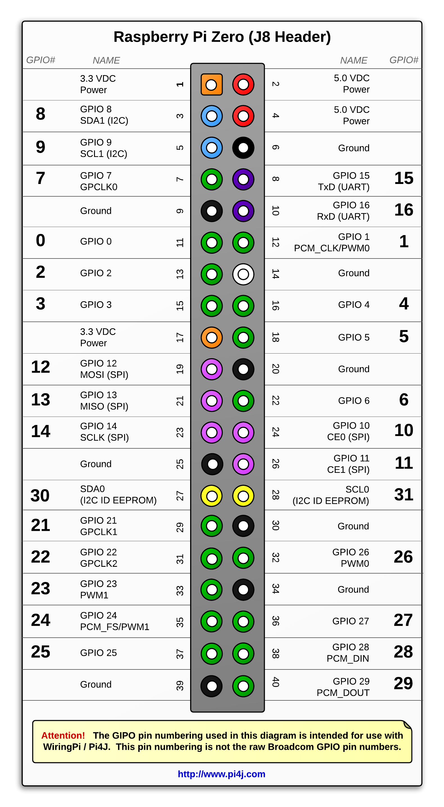

# LED Controller for Raspberry Pi

LED controller Spring Boot service for Raspberry Pi with UPnP support

# Background

My daughter has a firefly LED string that was battery operated. She got it from the Dollar Tree store. She loves it and uses it as a nightlight. I have a couple of Google Homes around and SmartThings in the house. When she says good night to Google her room is set for the night. Ceiling light off, bedside lamp on. But this little battery operated thing I always had to turn on and off myself.

Since it was running on 2 AA batteries it's perfect for the Pi's 3.3V output.

# Physical setup

I used a **Raspberry Pi 0 W**. I attached the LED String to pins 6 (GND) and 12 (GPIO 1 in Pi4J). I added a little tactile button to pins 14 (GND) and 18 (GPIO 5). I ordered some resistors from the Internet, but it didn't arrive yet. So the button is not that usable yet. The reading is very noisy, but it works most of the time.

Here's the RPi Zero's Pinout (from [Pi4J's website](http://pi4j.com/pins/model-zero-rev1.html))

# Installation

You'll need:

* Java 8 Development Kit

    `sudo apt-get update && sudo apt-get install oracle-java8-jdk`

* Maven

    `sudo apt-get install maven`

After this it's just `java -jar target/raspberrypi.ledcontroller-0.0.1-SNAPSHOT.jar`. 

If you want to make it start up when the Pi boots up, then `sudo nano /etc/rc.local` and add `java -jar target/raspberrypi.ledcontroller-0.0.1-SNAPSHOT.jar &` above the last line (which is `exit 0`).

If you wan't to make any changes to the setup you can override any values in the [application.properties](src/main/resources/application.properties) at startup. I.e. `java -jar -Dserver.port=9999 ...` For settings that are not in the properties file, check out [Spring Boot's reference page](https://docs.spring.io/spring-boot/docs/current/reference/html/common-application-properties.html) about common properties.

# SmartThings

If you want to use this with SmartThings, check out my [other repository](https://github.com/cl0udninja/raspberrypi.smartthings) with the SmartApp and Device Handler for this thing